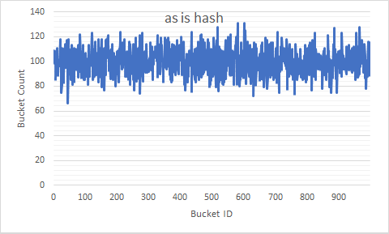
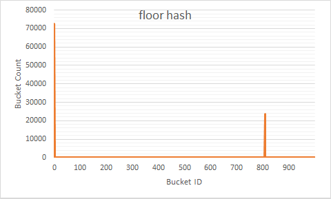
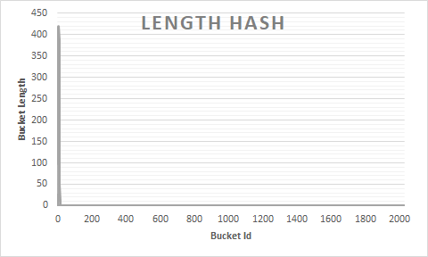
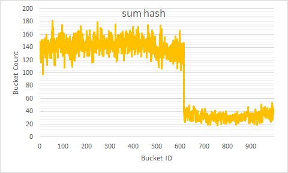
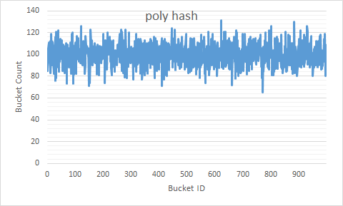
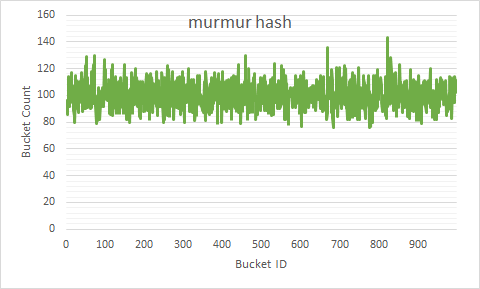
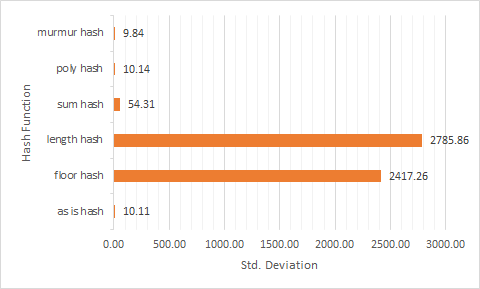
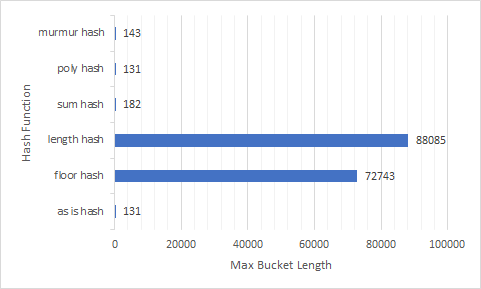

# Исследование распределений хеш-функций в задаче хранения слов художественного текста
## Введение
Рассмотрим следующую задачу:

*"Дано множество ключей - последовательностей из 32 байт. Требуется составить структуру данных, в которой можно было бы хранить набор уникальных ключей и быстро проверять наличие ключа в структуре."*

Задача может быть решена с использованием хеш-таблицы c закрытой адресацией (см. описание алгоритма на сайте [AlgoList](https://www.algolist.net/Data_structures/Hash_table)).

Введём следующие определения:
 - **ключ** (**элемент**) - идентификатор элемента, хранящегося в структуре. В случае рассматриваемой задачи это последовательность из 32 байт.
 - **хеш-функция** - функция, сопоставляющая ключам некоторые натуральные числа. Числа, сопоставляемые одинаковым ключам должны быть равны.
 - **хеш** - значение хеш-функции.
 - **список** (**bucket**) - множество элементов, в которое можно добавлять ключи и проверять, находятся ли они в нём. Соответствует структуре данных "связный список".
 - **хеш-таблица** (**таблица**) - множество списков, в каждом из которых всем ключам соответствуют одинаковые (по модулю количества списков в таблице) хеши.

**Проверка принадлежности** ключей к хеш-таблице происходит по следующему алгоритму:
 1. Пусть требуется проверить ключ $x$ на принадлежность к таблице. Посчитаем хеш элемента $h(x)$, где $h$ - хеш-функция.
 2. Рассмотрим $h(x) \text{mod} N$ - й список таблицы, где $N$ - количество списков в таблице. Если $x$ принадлежит списку, то $x$ принадлежит таблице. Иначе $x$ не принадлежит таблице.

|  |
| --- |
| *Рисунок 1. Иллюстрация к проверке принадлежности ключа к таблице. Зелёными ячейками обозначены индексы списков внутри таблицы. Синими клетками обозначены элементы самих списков. Символом '%' обозначено взятие числа по модулю. Остальные обозначения совпадают с обозначениями, введёнными в описании алгоритма.* |

**Добавление** ключа в таблицу происходит по следующему алгоритму:
 1. Если ключ $x$ уже принадлежит таблице, ничего не делать.
 2. Иначе добавить $x$ в $h(x) \text{mod} N$ - й список таблицы, где $N$ - количество списков в таблице, $h$ - хеш-функция.

|  |
| --- |
| *Рисунок 2. Иллюстрация к добавлению ключа к таблице. Обозначения аналогичны вводимым в рисунке 1.* |

Из алгоритма распределения ключей по спискам следует, что распределение зависит от выбора хеш-функции, используемой для подсчёта хешей элементов. К примеру, хеш-функция, возвращающая на все ключи число 1 (тождественно равная 1) даст распределение, отличное от того, что даёт хеш-функция, тождественно равная числу 2.

Целью данной работы было исследование распределений, даваемые различными хеш-функциям на массиве ключей, взятых из литературного текста.

Исследуемые хеш-функции:
 - `as_is_hash`: сопоставляет ключу хеш, состоящий из первых 8 байт ключа,
 - `floor_hash`: сопоставляет каждому ключу его округление вниз как число типа `double`,
 - `length_hash`: сопоставляет каждому ключу его длину как нуль-терминированного слова,
 - `sum_hash`: сопоставляет каждому ключу сумму значений его байт,
 - `murmur_hash`: функция хеширования MurmurHash64.

Реализации хеш-функций приведены в файле [src/hash/hash_functions.cpp](src/hash/hash_functions.cpp).

## Методы
Была составлена программа, реализующая хеш-таблицу на 1000 списков. Программа генерировала 100000 ключей (используя функцию `rand()`) и добавляла из в таблицу.

После распределения ключей по спискам хеш-таблицы в соответствии с хешами, выданными тестируемой хеш-функцией, программа измеряла длины получившихся списков и записывала измерения в файл в виде таблицы в формате `csv`.

## Результаты
Результаты измерений представлены на рисунках 3 - 9.

|  |
| --- |
| *Рисунок 1. Гистограмма распределения, даваемого `as_is_hash`.* |

|  |
| --- |
| *Рисунок 2. Гистограмма распределения, даваемого `floor_hash`.* |

|  |
| --- |
| *Рисунок 3. Гистограмма распределения, даваемого `length_hash`.* |

|  |
| --- |
| *Рисунок 4. Гистограмма распределения, даваемого `sum_hash`.* |

|  |
| --- |
| *Рисунок 5. Гистограмма распределения, даваемого `poly_hash`.* |

|  |
| --- |
| *Рисунок 6. Гистограмма распределения, даваемого `murmur_hash`.* |

|  |  |
| --- | --- |
| *Рисунок 7а. Сравнительная гистограмма среднеквадратических отклонений длин списков от всех исследованных хеш-функций.* | *Рисунок 7б. Сравнительная гистограмма максимумов длин списков от всех исследованных хеш-функций.* |

## Выводы и обсуждение
Как можно заметить, лучше всего на случайных данных работают `as_is_hash`, `poly_hash` и `murmur_hash`. Однако, `as_is_hash` может работать не правильно, если первые байты ключей не равномерны.
