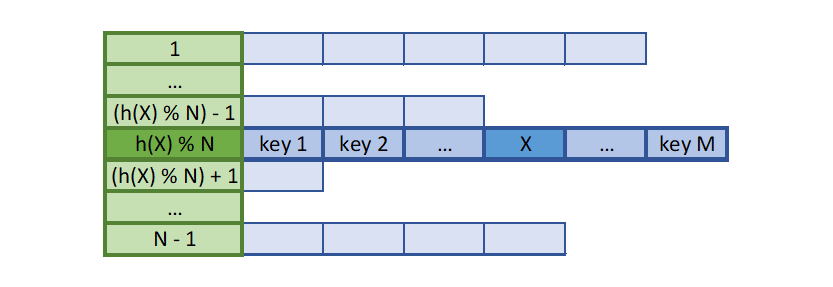
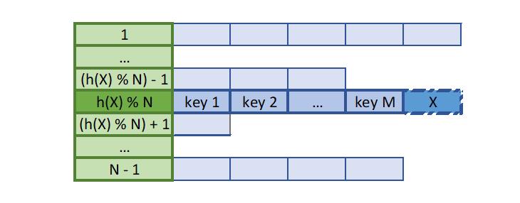

# Исследование оптимизаций поиска значений в хеш-таблице с закрытой адресацией.
## Введение
Рассмотрим следующую задачу:

*"Дан художественный текст на английском языке. Требуется составить множество слов текста, то есть структуру, хранящую все его слова и позволяющую как можно быстрее определять принадлежность некоторого слова к нему."*

Задача может быть решена с использованием хеш-таблицы c закрытой адресацией (описание алгоритма на [AlgoList](https://www.algolist.net/Data_structures/Hash_table)).

Введём следующие определения:
 - **ключ** (**элемент**) - идентификатор элемента, хранящегося в структуре. В случае рассматриваемой задачи это слово из текста.
 - **хеш-функция** - функция, сопоставляющая ключам некоторые натуральные числа. Числа, сопоставляемые одинаковым ключам должны быть равны.
 - **хеш** - значение хеш-функции.
 - **список** (**bucket**) - множество элементов, в которое можно добавлять ключи и проверять, находятся ли они в нём. Соответствует структуре данных "связный список".
 - **хеш-таблица** (**таблица**) - множество списков, в каждом из которых всем ключам соответствуют одинаковые по модулю количества списков в таблице хеши.

**Проверка принадлежности** ключей к хеш-таблице происходит по следующей последовательности действий:
 1. Пусть требуется проверить ключ $x$ на принадлежность к таблице. Посчитаем хеш элемента $h(x)$, где $h$ - хеш-функция.
 2. Рассмотрим $h(x) \text{mod} N$ - й список таблицы, где $N$ - количество списков в таблице. Если $x$ принадлежит списку, то $x$ принадлежит таблице. Иначе $x$ не принадлежит таблице.

|  |
| --- |
| *Фигура 1. Иллюстрация к проверке принадлежности ключа к таблице. Зелёными ячейками обозначены индексы списков внутри таблицы. Синими клетками обозначены элементы самих списков. Символом '%' обозначено взятие числа по модулю. Остальные обозначения совпадают с обозначениями, введёнными в описании алгоритма.* |

**Добавление** ключа в таблицу происходит по следующей последовательности действий:
 1. Если ключ $x$ уже принадлежит таблице, ничего не делать.
 2. Иначе добавить $x$ в $h(x) \text{mod} N$ - й список таблицы, где $N$ - количество списков в таблице, $h$ - хеш-функция.

|  |
| --- |
| *Фигура 2. Иллюстрация к добавлению ключа к таблице. Зелёными ячейками обозначены индексы списков внутри таблицы. Синими клетками обозначены элементы самих списков. Символом '%' обозначено взятие числа по модулю. Остальные обозначения совпадают с обозначениями, введёнными в описании алгоритма.* |

Целью данной работы является измерение коэффициента ускорения при использовании различных методов оптимизации проверки принадлежности элементов к таблице.

Исследуемые оптимизации:
 - оптимизация при помощи SIMD-intrinsics,
 - оптимизация ассемблерными вставками,
 - оптимизация переписыванием части кода на assembly и его линковки к основной программе, написанной на C.

## Методы
В качестве объекта оптимизации была взята программа, выполняющая следующие действия:
 1. заполнить хеш-таблицу на 2027 списков с хеш-функцией [MurmurHash64](https://en.wikipedia.org/wiki/MurmurHash) ключами, являющимися словами произведения Вильяма Шекспира ["The Comedy of Errors"](assets/comedy_of_errors.txt) в нижнем регистре в кодировке utf-8,
 2. 2000 раз выполнить поиск всех слов произведения в таблице (т.е. 2000 раз запустить цикл по всем словам произведения, для каждого из которых выполняется проверка на принадлежность к таблице).
 3. Повторить предыдущее действие 30 раз, записывая время исполнения каждого повтора в таблицу.
 4. Записать таблицу измерений в файл в формате `csv`.

Далее на программе были выполнены исследуемые оптимизации. Перед применением каждой оптимизации программа анализировалась valgrind с модулем callgrind для определения функции программы, оптимизация которой даст наибольший прирост производительности.

Текст подавался программе в виде бинарного файла, разбитого на области по 32 байта, каждая из которых хранила по одному слову текста в кодировке utf-8. Пустые байты были заполнены нулями, слова длинны более 32 игнорировались (в используемом тексте таких слов не было).

Флаги компиляции: `-ggdb3 -std=c++2a -O2 -pie -march=corei7 -mavx2` (из списка были исключены флаги типов `-I` и `-W`, полный список флагов см. в файле [makefile](makefile)).

Условия запуска:
 - Ноутбук Lenovo Legion 15ARH05H, подключенный к снабжающей его сети электропитания,
```
Processor	AMD Ryzen 5 4600H with Radeon Graphics            3.00 GHz
Installed RAM	16.0 GB (15.9 GB usable)
Product ID	00325-81942-83222-AAOEM
System type	64-bit operating system, x64-based processor
```
 - ОС: Windows 10 Home 22H2 (Build 19045.2846),
 - WSL: Ubuntu 20.04.5 LTS,
 - Температура процессора в момент тестирования не превышала 67 градусов Цельсия.

## Результаты
Результат работы не оптимизированной программы можно найти в файле [results/bmark_0.csv].(results/bmark_0.csv).

Среднее время обработки 2-го действия программы (поиска слов в тексте 2048 раз) составило $4.02\pm0.05$ секунд.

Стоит обратить внимание, что так как valgrind значительно замедляет программу, количество повторов поиска было снижено с 2000 до 1 в версиях, предназначенных для профилирования, и сделана соответствующая поправка при выборе следующей оптимизируемой функции. В листингах представлен НЕ модифицированный вывод анотатора вывода профилизатора.

Фрагмент результата профилирования программы на данном этапе приведён в листинге 1.
```log
--------------------------------------------------------------------------------
Ir         
--------------------------------------------------------------------------------
78,398,333  PROGRAM TOTALS

--------------------------------------------------------------------------------
Ir          file:function
--------------------------------------------------------------------------------
12,438,032  /build/glibc-SzIz7B/glibc-2.31/string/../sysdeps/x86_64/multiarch/memset-vec-unaligned-erms.S:__memset_avx2_unaligned_erms [/usr/lib/x86_64-linux-gnu/libc-2.31.so]
 9,931,680  ./src/hash/hash_functions.cpp:murmur_hash(void const*, void const*) [/root/projects/hash_functions/build/hash_testcase_v0.1_dev_linux.out]
 9,064,277  src/hash/hash_table.hpp:HashTable_find_value(HashTable const*, unsigned long long, char const*, int (*)(char const*, char const*)) [/root/projects/hash_functions/build/hash_testcase_v0.1_dev_linux.out]
 5,862,256  /build/glibc-SzIz7B/glibc-2.31/stdio-common/vfprintf-internal.c:__vfprintf_internal [/usr/lib/x86_64-linux-gnu/libc-2.31.so]
 5,525,198  /build/glibc-SzIz7B/glibc-2.31/libio/genops.c:_IO_default_xsputn [/usr/lib/x86_64-linux-gnu/libc-2.31.so]
 4,746,791  /build/glibc-SzIz7B/glibc-2.31/string/../sysdeps/x86_64/multiarch/strcmp-avx2.S:__strcmp_avx2 [/usr/lib/x86_64-linux-gnu/libc-2.31.so]
```
*Листинг 1. Фрагмент вывода valgrind, обработанного callgrind_annotate.*

Как можно заметить, дольше всего программа обрабатывает функции `murmur_hash` и `HashTable_find_value` (функцию поиска ключа в хеш-таблице). `murmur_hash` довольно сложно оптимизировать `SIMD-intrinsic`-ами, так что оптимизируем функцию `HashTable_find_value`, которая тратит незначительно больше ресурсов, чем `murmur_hash`, но при этом поддаётся оптимизации векторными регистрами.

После данной оптимизации среднее время обработки 2-го действия программы составило $0.71\pm0.01$ секунд.

Результат профилирования на данном этапе приведён в листинге 2.
```log
--------------------------------------------------------------------------------
Ir         
--------------------------------------------------------------------------------
59,569,618  PROGRAM TOTALS

--------------------------------------------------------------------------------
Ir         file:function
--------------------------------------------------------------------------------
9,931,680  ./src/hash/hash_functions.cpp:murmur_hash(void const*, void const*) [/root/projects/hash_functions/build/hash_testcase_v0.1_dev_linux.out]
6,162,303  src/hash/hash_table.hpp:HashTable_find_value(HashTable const*, unsigned long long, long long __vector(4), int (*)(long long __vector(4), long long __vector(4))) [/root/projects/hash_functions/build/hash_testcase_v0.1_dev_linux.out]
5,862,240  /build/glibc-SzIz7B/glibc-2.31/stdio-common/vfprintf-internal.c:__vfprintf_internal [/usr/lib/x86_64-linux-gnu/libc-2.31.so]
5,525,198  /build/glibc-SzIz7B/glibc-2.31/libio/genops.c:_IO_default_xsputn [/usr/lib/x86_64-linux-gnu/libc-2.31.so]
```
*Листинг 2. Фрагмент вывода valgrind, обработанного callgrind_annotate.*

Время работы данной версии программы составляет $0.50\pm0.01$ секунд.

Ускорение относительно предыдущей версии программы составило $1.42\pm0.06$ раза.

Попытаемся ускорить функцию `murmur_hash`, переписав её с использованием ассемблерных вставок. Стоит заметить, что так как наличие ассемблерных вставок в функции запрещает компилятору применять большинство оптимизаций, имеет смысл лишь переписывание всей функции за исключением разве что заголовка, и то для данной функции он тривиален (т.е. включает только `label` функции без фиксации stack frame-а). За основу переписанной версии можно взять код, сгенерированный компилятором `CLang`, генерирующий для данной функции более эффективный код, чем используемый для компиляции проекта `gcc`. Далее для оптимизации можно убрать из кода несколько проверок, не требующихся в контексте данной задачи (к примеру проверки на длину ключа, так как мы знаем, что это значение - константа).

С данной оптимизацией среднее среднее время обработки стало $0.50\pm0.02$ секунды. Ускорение относительно предыдущей версии - $1.01\pm0.05$.

```log
--------------------------------------------------------------------------------
Ir         
--------------------------------------------------------------------------------
59,538,352  PROGRAM TOTALS

--------------------------------------------------------------------------------
Ir         file:function
--------------------------------------------------------------------------------
9,931,680  ./src/hash/hash_functions.cpp:murmur_hash(void const*, void const*) [/root/projects/hash_functions/build/hash_testcase_v0.1_dev_linux.out]
6,162,303  src/hash/hash_table.hpp:HashTable_find_value(HashTable const*, unsigned long long, long long __vector(4), int (*)(long long __vector(4), long long __vector(4))) [/root/projects/hash_functions/build/hash_testcase_v0.1_dev_linux.out]
5,862,240  /build/glibc-SzIz7B/glibc-2.31/stdio-common/vfprintf-internal.c:__vfprintf_internal [/usr/lib/x86_64-linux-gnu/libc-2.31.so]
```
*Листинг 3. Фрагмент вывода valgrind, обработанного callgrind_annotate.*

Так как ускорение мало и не превосходит погрешности эксперимента, логичном шагом на данной этапе было бы прекращение попыток оптимизации хотя бы данной функции.

*Но мы продолжим "оптимизировать" код, чтобы показать, что мы умеем линковать C-шные программы с asm-овскими.*

Выделим переписанную на asm функцию `murmur_hash` в отдельный файл и прилинкуем его к проекту, надеясь на улучшение.

Среднее время обработки с данной "оптимизацией" составило $0.50\pm0.01$ секунды. Ускорение - $1.01\pm0.05$ раза.

Обработка исходных результатов экспериментов была проведена в файле [results/bmark_combined.xlsx](results/bmark_combined.xlsx).

## Обсуждение и выводы
Как было показано, наиболее эффективной оптимизацией была оптимизация SIMD-intrinsic-ами. Обе оптимизации ассемблером дали незначительное ускорение.

Результаты показывают, что современные компиляторы хорошо оптимизируют код, написанный на языке программирования C, в связи с чем имеют смысл лишь оптимизации с изменением логики работы программы. К примеру, первая из приведённых оптимизаций дала наилучший результат, так как предполагала изменение логики работы программы под использование векторных регистров, которое было возможно только с дополнительными предположениями о данных, обрабатываемых программой. Очевидно, компилятор не может выполнить данные оптимизации, так как не обладает необходимой информацией.
